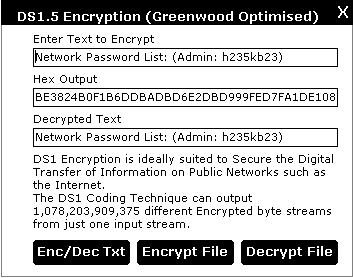



## DS1 \(Ver1\.5\) Encryption: Highly Optimised 4MB/Sec

### Description

(This is not Home-Made Crap!)DS1 Encryption is ideally suited to Secure the Digital Transfer of Information on Public Networks such as the Internet. Very Secure, Optimised by David Midkiff. I challenge all cryptoanalysers to break the cipher when used with a Secure key. Feed back Very Welcome. The DS1 Coding Technique can output 1,078,203,909,375 different Encrypted byte streams from just one input stream. Therefore even if the same data is transmitted again it will not look the same. TECHNIQUES USED: This is achieved by selecting 5 random bytes and adding them to the start of the byte stream. The byte stream then undergoes CBC (Cipher Block Chaining),byte & bit level processing before being outputted as 1 of the 1,078,203,909,375 different possible byte outputs.
 
### More Info
 

             |
---                |---
**Submitted On**   |2001-12-16 21:48:14
**By**             |[Dave Greenwood](https://github.com/Planet-Source-Code/PSCIndex/blob/master/ByAuthor/dave-greenwood.md)
**Level**          |Advanced
**User Rating**    |5.0 (35 globes from 7 users)
**Compatibility**  |VB 5\.0, VB 6\.0
**Category**       |[Encryption](https://github.com/Planet-Source-Code/PSCIndex/blob/master/ByCategory/encryption__1-48.md)
**World**          |[Visual Basic](https://github.com/Planet-Source-Code/PSCIndex/blob/master/ByWorld/visual-basic.md)
**Archive File**   |[DS1\_\(Ver1\_42508121620\.zip](https://github.com/Planet-Source-Code/dave-greenwood-ds1-ver1-5-encryption-highly-optimised-4mb-sec__1-29849/archive/master.zip)

